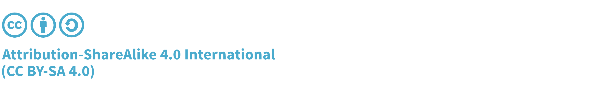

# 扉

## 本標準について

OWASP Internet of Things セキュリティ検証標準 (ISVS) は Internet of Things (IoT) アプリケーションに対するセキュリティ要件のフレームワークを確立するためのコミュニティの取り組みです。ISVS が提供する要件は IoT アプリケーションの設計、開発、テストなどの製品開発ライフサイクルの多くのステージで使用できます。

## 著作権とライセンス

Copyright © 2021 The OWASP Foundation.

本書は [Creative Commons Attribution ShareAlike 4.0 license](https://creativecommons.org/licenses/by-sa/4.0/) の下でリリースされています。再使用または配布する場合は、他者に対し本著作物のライセンス条項を明らかにする必要があります。

Version 1.0, 22 January 2021

## プロジェクトリーダー

- Cédric Bassem
- Aaron Guzman

## 寄稿者およびレビュー担当者

- Théo Rigas
- Leo Dorrendorf
- Anna Schnaiderman

IoT セキュリティ検証標準はボランティアと寄稿者の熱心な取り組みの上に構築されています。このプロジェクトは [OWASP アプリケーションセキュリティ検証標準](https://owasp.org/www-project-application-security-verification-standard/) の付録の一部として開始され、IoT のトピックには独自の標準が必要であると判断されました。

上記のクレジットリストにクレジットがない場合は、プロジェクトリーダー aaron.guzman@owasp.org , cedric.bassem@owasp.org に連絡するか、今後の更新で認識されるように GitHub にチケットを記録してください。
