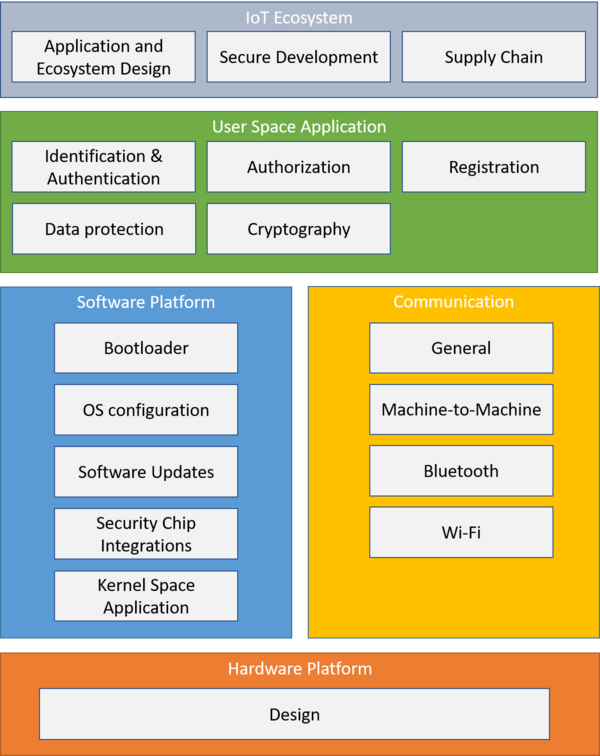

# ISVS の使い方

OWASP Internet of Things セキュリティ検証標準 (ISVS) は、コネクテッドデバイスに対して要件とベストプラクティスを提供することにより、IoT アプリケーションのセキュリティに対する信頼レベルを確立することを目的としています。

IoT アプリケーションは多くの場合、複雑なエコシステムを形成する相互接続された多くのアプリケーションで構成されています。そのため IoT アプリケーションの保護はエコシステムの保護につながります。したがって、ISVS は業界で受け入れられている既存の標準を可能な限り参照しながら、組み込みアプリケーションとそれらが存在する IoT エコシステムのセキュリティ要件を明示します。

## ISVS セキュリティモデル

ISVS により提供されるセキュリティコントロール要件はスタックとして表すことができます。最下部には、ハードウェアプラットフォームに対する要件 ([V5](V5-Hardware_Platform_Requirements.md)) が示されています。ISVS 全体を通して、ハードウェアプラットフォームはコネクテッドデバイスの基盤を構成するさまざまなハードウェアコンポーネントとみなされます。ハードウェアプラットフォームの上にはソフトウェアプラットフォーム ([V3](V3-Software_Platform_Requirements.md)) および通信 ([V4](V4-Communication_Requirements.md)) 要件があり、ハードウェアプラットフォームを利用してリッチアプリケーションの開発を可能にします。これらのアプリケーションに対する要件はユーザー空間アプリケーション要件レイヤー ([V2](V2-User_Space_Application_Requirements.md)) で提供されます。最後に、IoT エコシステムの章ではコネクテッドデバイスと周囲のエコシステムとの間をつなぐ一連の要件を提供します ([V1](V1-IoT_Ecosystem_Requirements.md)) 。

## セキュリティ検証レベル
ISVS は三つのセキュリティ検証レベルを示しており、レベルごとに深さを増していきます。各レベルにはセキュリティ上の重要な要素や機能にマップされた一連の要件が含まれています。

### ISVS レベル 1
レベル 1 要件の目標はソフトウェアのみを対象とする攻撃、つまりデバイスへの物理的なアクセスを伴わない攻撃に対する保護を提供することです。レベル 1 要件は、デバイスの物理的な侵害によってセキュリティへの影響が大きくなることはない、コネクテッドデバイスに対するセキュリティベースラインを提供することを目的としています。これらはデバイスの IP を保護しないデバイスであり、デバイス上に機密情報は保存されず、一つのデバイスが侵害されても攻撃者は IoT エコシステム上の他のデバイスやシステムに横移動することはできません。

レベル 1 デバイスの例としては既製のハードウェアおよびソフトウェアコンポーネントで作成されているスマート電球があります。電球が危険にさらされても、攻撃者は最先端のテクノロジにアクセスできません。デバイスに個人データが保存されていない場合、盗まれるデータはありません。認証と認可がサポートするクラウドインフラストラクチャに正しく実装されている場合、攻撃者が行う最悪の事態は侵害された電球のステータスをスプーフィングすることです。

### ISVS レベル 2
レベル 2 要件の目標はソフトウェアを越えてデバイスのハードウェアを標的とする攻撃に対する保護を提供することです。レベル 2 要件に準拠するデバイスはデバイスの侵害を回避する必要があるデバイスです。これらはデバイスの IP を妥当な範囲で保護する必要があり、デバイスに何らかの形式の機密情報が保存されているデバイスです。

レベル 2 デバイスの例としてはスマートロック、アラームシステム、スマートカメラ、計測データを集約して分析のために医師に送信する医療機器があります。

### ISVS レベル 3
レベル 3 要件の目標は侵害を絶対に回避する必要があるデバイスに対する要件を提供することです。機密性の高い情報がデバイスに保存されているデバイスやデバイスの侵害が詐欺につながる可能性のあるデバイスです。レベル 1 および 2 で提供されるセキュリティ要件に加えて、レベル 3 要件では多層防御技術に焦点を当て、リバースエンジニアリングと物理的な改竄の取り組みを阻止することを試みます。

レベル 3 デバイスの例としては、ハードウェア暗号ウォレット、スマートメーター、コネクテッドカー、医療用インプラント、アルミ缶をお金と交換するリサイクルマシンなどがあります。

## 推奨される使い方
IoT アプリケーションはそれぞれ大きく異なります。センサーとハブを使用するアプリケーションもあれば、センサーを備えていないものもあります。組み込み Linux を実行するものもあれば、そうでないものもあります。ISVS は可能な限り広く適用できるように要件を構造化および定義することを目的としていますが、ISVS でのすべての要件が特定のデバイスに適用できるとは限りません。ISVS をユースケースに合わせて調整し、あなたの環境にとって最も重要な影響の大きい要件に焦点を当てることを強くお勧めします。これには必要となる望ましいセキュリティレベルを理解するためにリスク評価が必要になることがあります。

この標準は検証標準と呼ばれていますが、コネクテッドデバイスの全体的なセキュリティ体制を検証するための要件を提供するよりもはるかに広く使用されています。要件が検証の観点から記されているという事実により、各要件が実際に測定可能かつ達成可能であることが保証されます。その結果として、要件はコネクテッドデバイスの開発プロセスのさまざまなステージで使用できます。いくつかの例を以下に示します。

- サポートするハードウェアプラットフォームの設計時に、 [V5](V5-Hardware_Platform_Requirements.md) のハードウェアプラットフォーム要件を作成し、ハードウェアプラットフォームが他の要件カテゴリの章で記述されているセキュリティ要件を実装するために必要なすべての機能を提供することを妥当性確認できるようになります。

- ISVS にリストされている要件はプロジェクトの要件獲得フェーズで使用できます。たとえば、製品のセキュアな開発ライフサイクルの開始時にセキュリティ要件を定義する際、ISVS は製品の開発をガイドすべき最低限の要件として使用できます。

- ISVS はカスタム IoT ソリューションの調達に使用できます。サードパーティが IoT 製品またはソリューションの開発を契約している場合、買い手側はソリューションが特定の ISVS セキュリティレベルに沿って開発されることを要求し、ソリューションが必要な ISVS セキュリティレベルを満たしていることの証明を要求できます。

- 内部向けまたは外部向けの IoT セキュリティトレーニングを開発する際、IoT システムに対する一般的な攻撃をデモしたり見せたりするのではなく、特定のユースケースにおけるベストプラクティスを確実に含むようにカリキュラムをガイドするために ISVS を使用することができます。

- 要件を使用してデバイスの環境の全体的なセキュリティ体制を評価できます。テストケースの定義に役立つこともあれば、セキュリティ専門家がデバイスの実装を評価するために使用することもあります。

- ISVS はよりセキュアな製品を実現するためのアジャイル開発プロセスをガイドするフレームワークとして使用できます。ほとんどの新しい IoT デバイスハードウェアは最初にプロトタイプシステムまたは開発ボードから開発されるため、ISVS レベルはソフトウェアとハードウェアのセキュリティに焦点を当てており、組織のアジャイルセキュリティプラクティスの一環として簡単に統合できます。プロジェクトはプロジェクトのリスク評価に沿って最終目標の ISVS レベルを定義することから開始し、ISVS 要件を開発バックログのチケットとして使用できます。特定の機能に優先順位付けでき、セキュリティの取り組みをボード上で簡単に視覚化できます。これは組織内の監査およびレビュータスクに優先順位付けするためにも使用できます。特定の要件は特定チームメンバーの実装、レビュー、リファクタ、または監査のドライバとなり、バックログに "負債" として可視化されます。

## ドキュメント構造
この標準の後続の章では上記のさまざまな要件カテゴリの概要を提供します。各要件カテゴリには専用の章があり、関連する標準への参照情報とともに要件がリストされています。標準全体で使用されているさまざまな単語の定義は [付録 A - 用語集](Appendix_A-Glossary.md) に記載されています。
