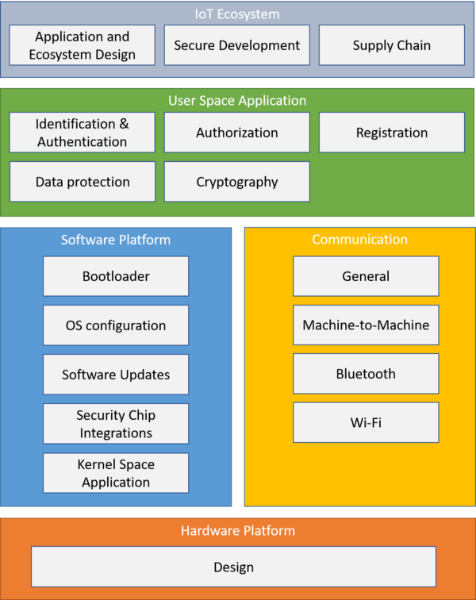

# ISVS の使い方

OWASP Internet of Things セキュリティ検証標準 (ISVS) は、ソフトウェアおよびハードウェアコンポーネントや、コネクテッドデバイスの通信に対して要件とベストプラクティスを提供することにより、IoT エコシステムのセキュリティに対する信頼レベルを確立することを目的としています。

多くの場合、IoT エコシステムは相互接続された多くのシステムの複雑な集合体です。相互接続されたこれらのシステムの中には、コネクテッドデバイスやそのコンポーネント (ソフトウェアとハードウェアの両方) を含む IoT システムがあります。IoT エコシステムのシステムの例としては、他にもウェブアプリケーションやモバイルアプリケーション、クラウドコンポーネントがあります。

ISVS は IoT システムやそのコンポーネント (IoT ハードウェア、ソフトウェア、組み込みアプリケーション、通信プロトコル) に対するセキュリティ要件を提供することに重点を置いています。また、業界で受け入れられている既存の標準を可能な限り参照しながら、IoT システムが存在する IoT エコシステムに対して一般的な要件をいくつか提供しています。

## ISVS セキュリティモデル

ISVS により提供されるセキュリティ要件はスタックとして表すことができます。最下部には、ハードウェアプラットフォームに対する要件 ([V5](V5-Hardware_Platform_Requirements.md)) が示されています。ISVS 全体を通して、ハードウェアプラットフォームはコネクテッドデバイスの基盤を構成するさまざまなハードウェアコンポーネントとみなされます。ハードウェアプラットフォームの上にはソフトウェアプラットフォーム ([V3](V3-Software_Platform_Requirements.md)) および通信 ([V4](V4-Communication_Requirements.md)) 要件があり、ハードウェアプラットフォームを利用してリッチアプリケーションの開発を可能にします。これらのアプリケーションに対する要件はユーザー空間アプリケーション要件レイヤー ([V2](V2-User_Space_Application_Requirements.md)) で提供されます。最後に、IoT エコシステムの章ではコネクテッドデバイスと周囲のエコシステムとの間をつなぐ一連の要件を提供します ([V1](V1-IoT_Ecosystem_Requirements.md)) 。

## セキュリティ検証レベル
ISVS は三つのセキュリティ検証レベルを示しており、レベルごとに深さを増していきます。各レベルにはセキュリティ上の重要な要素や機能にマップされた一連の要件が含まれています。

### ISVS レベル 1
レベル 1 要件の目標はソフトウェアのみを対象とする攻撃、つまりデバイスへの物理的なアクセスを伴わない攻撃に対する保護を提供することです。レベル 1 要件は、デバイスの物理的な侵害によってセキュリティへの影響が大きくなることはない、コネクテッドデバイスに対するセキュリティベースラインを提供することを目的としています。これらはデバイスの IP を保護しないデバイスであり、デバイス上に機密情報は保存されず、一つのデバイスが侵害されても攻撃者は IoT エコシステム上の他のデバイスやシステムに横移動することはできません。

レベル 1 デバイスの例としては既製のハードウェアおよびソフトウェアコンポーネントで作成されているスマート電球があります。電球が危険にさらされても、攻撃者は最先端のテクノロジにアクセスできません。デバイスに個人データが保存されていない場合、盗まれるデータはありません。認証と認可がサポートするクラウドインフラストラクチャに正しく実装されている場合、攻撃者が行う最悪の事態は侵害された電球のステータスをスプーフィングすることです。

### ISVS レベル 2
レベル 2 要件の目標はソフトウェアを越えてデバイスのハードウェアを標的とする攻撃に対する保護を提供することです。レベル 2 要件に準拠するデバイスはデバイスの侵害を回避する必要があるデバイスです。これらはデバイスの IP を妥当な範囲で保護する必要があり、デバイスに何らかの形式の機密情報が保存されているデバイスです。

レベル 2 デバイスの例としてはスマートロック、アラームシステム、スマートカメラ、計測データを集約して分析のために医師に送信する医療機器があります。

### ISVS レベル 3
レベル 3 要件の目標は侵害を絶対に回避する必要があるデバイスに対する要件を提供することです。機密性の高い情報がデバイスに保存されているデバイスやデバイスの侵害が詐欺につながる可能性のあるデバイスです。レベル 1 および 2 で提供されるセキュリティ要件に加えて、レベル 3 要件では多層防御技術に焦点を当て、リバースエンジニアリングと物理的な改竄の取り組みを阻止することを試みます。

レベル 3 デバイスの例としては、ハードウェア暗号ウォレット、スマートメーター、コネクテッドカー、医療用インプラント、アルミ缶をお金と交換するリサイクルマシンなどがあります。

## 推奨される使い方
IoT エコシステムはそれぞれ大きく異なります。センサーとハブを使用するエコシステムもあれば、センサーを備えていないものもあります。組み込み Linux を実行するコネクテッドデバイスもあれば、そうでないものもあります。ISVS は可能な限り広く適用できるように要件を構造化および定義することを目的としていますが、ISVS でのすべての要件が特定のエコシステムやデバイスに適用できるとは限りません。ISVS をユースケースに合わせて調整し、あなたのエコシステムやデバイスにとって最も重要な影響の大きい要件に焦点を当てることを強くお勧めします。これには必要となる望ましいセキュリティレベルを理解するためにリスク評価が必要になることがあります。

この標準は検証標準と呼ばれていますが、コネクテッドデバイスやそのコンポーネントの全体的なセキュリティ体制を検証するための要件を提供するよりもはるかに広く使用されています。要件が検証の観点から記されているという事実により、各要件が実際に測定可能かつ達成可能であることが保証されます。その結果として、要件はコネクテッドデバイスの開発プロセスのさまざまなステージで使用できます。いくつかの例を以下に示します。

- サポートするハードウェアプラットフォームの設計時に、 [V5](V5-Hardware_Platform_Requirements.md) のハードウェアプラットフォーム要件を作成し、ハードウェアプラットフォームが他の ISVS の章で記述されているセキュリティ要件を実装するために必要なすべての機能を提供することを妥当性確認できるようになります。

- ISVS にリストされている要件はプロジェクトの要件獲得フェーズで使用できます。たとえば、製品のセキュアな開発ライフサイクルの開始時にセキュリティ要件を定義する際、ISVS は製品の開発をガイドすべき最低限の要件として使用できます。

- ISVS はカスタム IoT ソリューションの調達に使用できます。サードパーティが IoT 製品またはソリューションの開発を契約している場合、買い手側はソリューションが特定の ISVS セキュリティレベルに沿って開発されることを要求し、ソリューションが必要な ISVS セキュリティレベルを満たしていることの証明を要求できます。

- 内部向けまたは外部向けの IoT セキュリティトレーニングを開発する際、IoT システムに対する一般的な攻撃をデモしたり見せたりするのではなく、特定のユースケースにおけるベストプラクティスを確実に含むようにカリキュラムをガイドするために ISVS を使用することができます。

- 要件を使用してデバイスの環境の全体的なセキュリティ体制を評価できます。テストケースの定義に役立つこともあれば、セキュリティ専門家がデバイスの実装を評価するために使用することもあります。

- ISVS はよりセキュアな製品を実現するためのアジャイル開発プロセスをガイドするフレームワークとして使用できます。ほとんどの新しい IoT デバイスハードウェアは最初にプロトタイプシステムまたは開発ボードから開発されるため、ISVS レベルはソフトウェアとハードウェアのセキュリティに焦点を当てており、組織のアジャイルセキュリティプラクティスの一環として簡単に統合できます。プロジェクトはプロジェクトのリスク評価に沿って最終目標の ISVS レベルを定義することから開始し、ISVS 要件を開発バックログのチケットとして使用できます。特定の機能に優先順位付けでき、セキュリティの取り組みをボード上で簡単に視覚化できます。これは組織内の監査およびレビュータスクに優先順位付けするためにも使用できます。特定の要件は特定チームメンバーの実装、レビュー、リファクタ、または監査のドライバとなり、バックログに "負債" として可視化されます。

## 不適合の扱い

ISVS で規定されているすべてのセキュリティコントロールが、あらゆる IoT エコシステムやデバイスに適用可能、実現可能、あるいは必要であるとは限りません。組織は、セキュリティコントロールの導入には、労力とリスク低減のバランスを考慮した、リスクに基づく意思決定プロセスを伴うことを認識する必要があります。

### リスクに基づく意思決定

セキュリティコントロールが実装できない場合やコントロールの検証が失敗する場合には、組織は以下を行う必要があります。

1. **リスクを評価する**: コントロールを実装しないこと、あるいは特定された脆弱性を許容することによる、潜在的なセキュリティ上の影響を評価します。以下のような要素を考慮します。
   - デバイスで処理されるデータの機密性
   - デバイスの機能の重要度
   - 脅威の状況と悪用の発生可能性
   - 侵害によるビジネスと安全性への潜在的な影響

2. **決定事項を文書化する**: どのコントロールが実装されないか、およびその理由について、明確な記録を保持します。文書には以下を含む必要があります。
   - 満たさない具体的な要件
   - 未実装または受容に至る根拠
   - 評価されたリスクレベル
   - 補償コントロールまたはリスク緩和策
   - 適切な利害関係者による承認

3. **補償コントロールを実装する**: 可能な限り、当初の要件を完全には満たさない場合でもリスクを低減する代替セキュリティコントロールを実装します。

4. **定期的に見直す**: 許容したリスクや不適合について、特に以下の場合に、定期的に再評価します。
   - 脅威の状況が変化した
   - 新しい脆弱性が発見された
   - デバイスのデプロイメント状況が変化した
   - より費用対効果の高いセキュリティソリューションが利用可能になった

### 部分的な適合

IoT システムは、カテゴリごとに異なるレベルの要件を満たすことで、ISVS への部分的な適合を達成することがあります。たとえば、デバイスが暗号化についてレベル 3 要件を満たしても、通信プロトコルについてはレベル 1 しか満たしていないかもしれません。組織は、ISVS への適合を報告する際、各カテゴリについて達成した具体的なレベルを明確に伝える必要があります。

### 継続的な改善

ISVS は、単発のチェックリストではなく、継続的にセキュリティを改善するためのフレームワークとして捉える必要があります。組織には以下を推奨します。
- 組織のリスクレベルに応じたセキュリティ要件のベースラインから開始する
- 製品イテレーションを通じてセキュリティコントロールを段階的に強化する
- セキュリティ検証結果を使用して開発の優先順位付けに活用する
- 知見やベストプラクティスをより広範な IoT セキュリティコミュニティと共有する

## ドキュメント構造
この標準の後続の章では上記のさまざまな要件カテゴリの概要を提供します。各要件カテゴリには専用の章があり、関連する標準への参照情報とともに要件がリストされています。標準全体で使用されているさまざまな単語の定義は [付録 A - 用語集](Appendix_A-Glossary.md) に記載されています。
